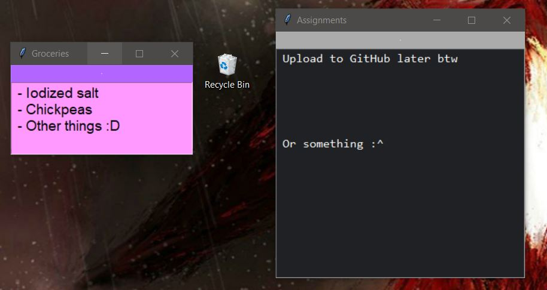

# StickyNoteWidget
A virtual Sticky Note to be placed on a Windows desktop using Python's Tkinter module.

  

## Features
- Automatically saves text, size, and location of window upon typing or clicking the `X` button. No need to manually save.
- Automatically saves a backup for each day of the week, 7 backups in total.
- Change attributes such as font size in `StickyNotes/NAME/immutableConfig.txt`.

## How to Install
1. Ensure Python is installed along with the Tkinter library (typically included by default).
2. Run once.
3. To open multiple StickyNotes, create new folders in the `StickyNotes` directory, located in the same directory as `StickyNoteWidget.py`.
4. Enjoy!

  

## What's New?
- Saves configurations for all StickyNotes upon clicking `X` from `StickyNoteHub`; the root window.

## Old Changes
- Can now process multiple StickyNotes simultaneously. Details in [How to Install](#how-to-install).
- StickyNoteHub exists. Limited functionality as of now; just displays which StickyNotes are currently open.
- Creates the necessary files if they do not exist yet and no longer requires the use of the pesky _Environment Variable_. All makes for a more streamlined installation process.
- Gave StickyNotes an ID: their title. No functional differences yet other than a change in the window's title and a reworked folder system.
- Fixed the code's _style_ to something more readable. Includes making comments more insightful, better whitespace usage, etc. Also changed the names of several files, mostly removing underscores in favor of CamelCase.
- Converted StickyNoteWidget from a Procedural Program into an Object-Oriented Program (OOP). This will streamline debugging, adding new features, updating the code style, etc. _Does not change functionality._

