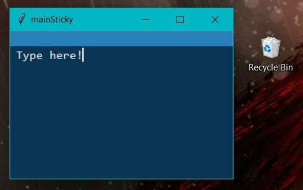
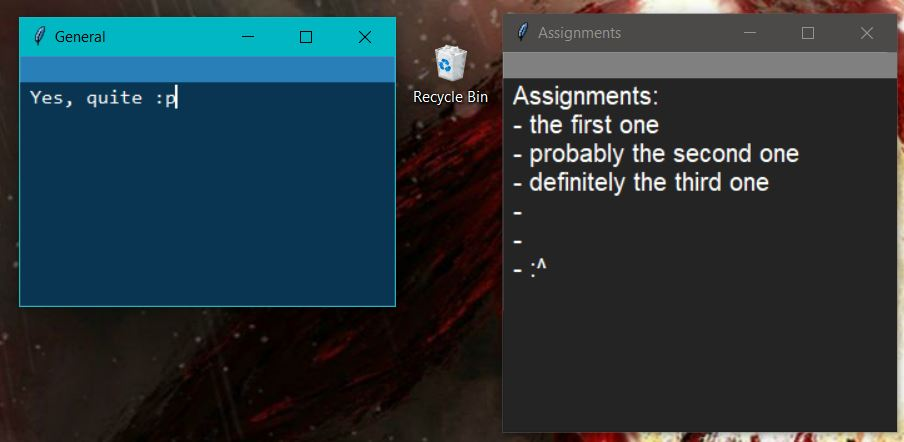

# StickyNoteWidget
A virtual Sticky Note to be placed on a Windows desktop using Python's Tkinter module.

  

## Features
> Will update this section once the project's finished :^)

## Tutorial
> Will update this section once the project's finished :^)
### How to Install 
1. Ensure Python, along with the TKinter library, is installed.
2. Download `StickyNoteWidget.zip`.
3. Extract `StickyNoteWidget.zip`'s contents to a folder.
4. From the extracted contents, execute `StickyNoteWidget.pyw`.
5. Enjoy!

**NOTE** Opening multiple stickyNotes requires configuring one's `stickyNoteDatabase.db` directly. (A native method will be implemented within the next few updates.)

  

## What's New?
- Added window icons :D Required to download the zip file to utilize them.

## Old Changes
- Optimize to run faster. This is due to not running several SQLite queries per second. Instead, a stickyNote will only update the database when the user defocus from the window.
- Replaced all folders and flat files with one `stickyNoteDatabase.db`. Having done so, development will become more streamlined.
- The zoom in/out features now save.
- Removed `StickyNoteWidget.exe`. As I do not have the ability to sign my exe files, there is *seemingly* no surefire way to ensure it is not recognized as a virus.

## Old Changes (before SQLite)
- Added a couple more commands. Use `ctrl + w` to save and quit. Use `ctrl + s` to save. Not very necessary as autosave covers most activity, but it does give an indicator for peace of mind.
- Added a zoom in/out feature. AKA, increase or decrease the size of the font using the commands -> `ctrl + plus` and `ctrl + minus`.
- Wraps text around words (standard) as opposed to chars.
- Converted `StickyNoteWidget.py` to `StickyNoteWidget.pyw` to remove terminal window spawn.
- Added `StickyNoteWidget.exe` to improve accessibility.
- Left and right border widths are no longer slightly incongruent.
- Converted the bar from a frame to a label widget.
- Saves configurations for all StickyNotes upon clicking `X` from `StickyNoteHub`; the root window.
- Can now process multiple StickyNotes simultaneously. Details in [How to Install](#how-to-install).
- StickyNoteHub exists. Limited functionality as of now; just displays which StickyNotes are currently open.
- Creates the necessary files if they do not exist yet and no longer requires the use of the pesky _Environment Variable_. All makes for a more streamlined installation process.
- Gave StickyNotes an ID: their title. No functional differences yet other than a change in the window's title and a reworked folder system.
- Fixed the code's _style_ to something more readable. Includes making comments more insightful, better whitespace usage, etc. Also changed the names of several files, mostly removing underscores in favor of CamelCase.
- Converted StickyNoteWidget from a Procedural Program into an Object-Oriented Program (OOP). This will streamline debugging, adding new features, updating the code style, etc. _Does not change functionality._
