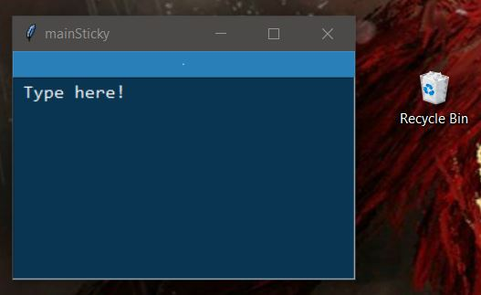
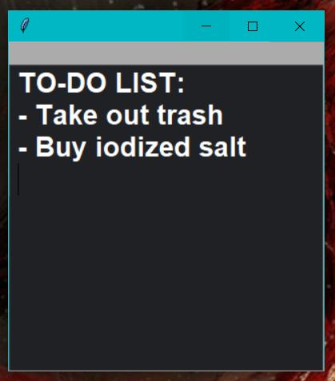

# StickyNoteWidget
A virtual sticky note to be placed on a Windows desktop using Python's Tkinter module.

  

## What's New?
- Creates the necessary files if they do not exist yet and no longer requires the use of the pesky _Environment Variable_. All makes for a more streamlined installation process.
- Gave StickyNotes an ID: their title. No functional differences yet other than a change in the window's title and a reworked folder system.

## Old Changes
- Fixed the code's _style_ to something more readable. Includes making comments more insightful, better whitespace usage, etc. Also changed the names of several files, mostly removing underscores in favor of CamelCase.
- Converted StickyNoteWidget from a Procedural Program into an Object-Oriented Program (OOP). This will streamline debugging, adding new features, updating the code style, etc. _Does not change functionality._

## How to Install
1. Ensure Python is installed along with the Tkinter library (typically included by default).
2. Enjoy!

## Features
- Automatically saves text, size, and location of window upon typing or clicking the `X` button. No need to manually save.
- Automatically saves a backup for each day of the week, 7 backups in total.
- Easily change attributes such as font size in `StickyNotes/NAME/immutableConfig.txt`.

  

## Known Issues
- Cannot handle certain characters well, such as emojis
- Cannot boldface, italics, etc. for specific snippets of text. It's either all or nothing.
- Spawns a useless black box (Python's terminal window) if opening outside the context of an IDE.
- Text may not wrap around the window properly.
- The x and y attributes slightly save the location of the window incorrectly, only solved with `xAdjust` and `yAdjust` in `immutableConfig.txt`.
- Putting the widget into `ORR mode` renders it impossible to move or close through normal methods; requires ending the task manually in task manager.