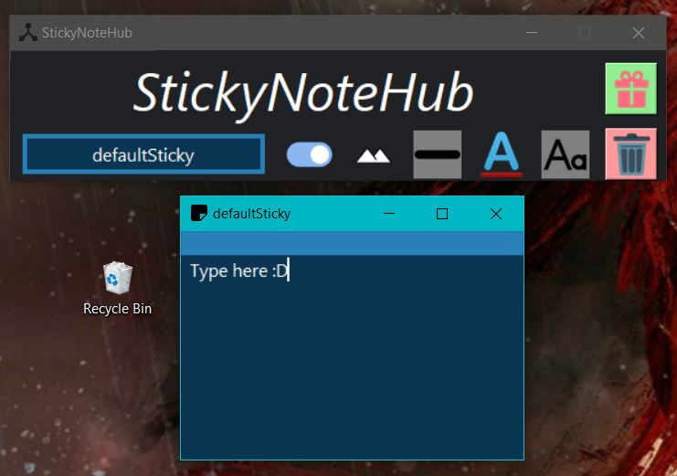
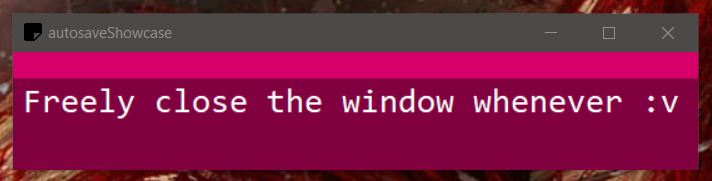
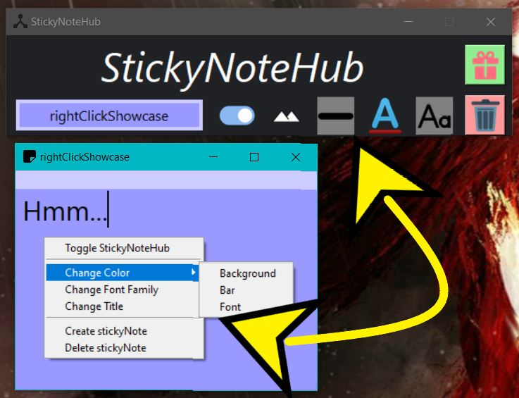
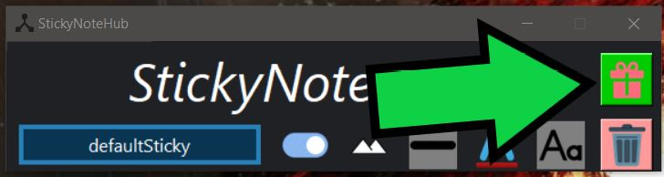
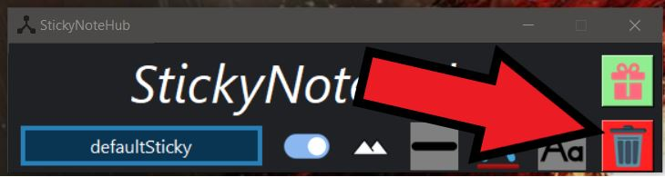
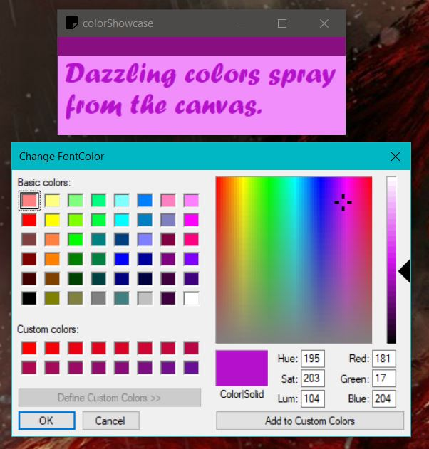
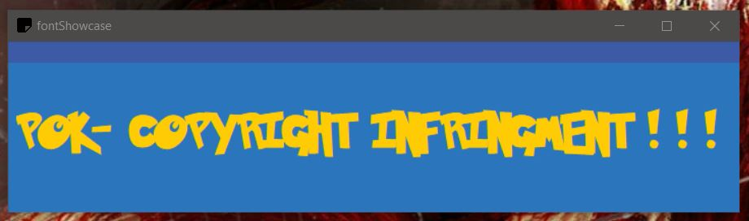
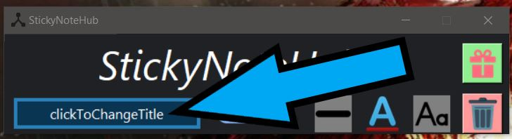
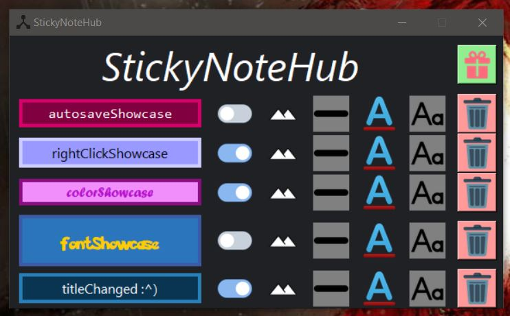

# StickyNoteWidget
A virtual stickyNote placed on the desktop. 
Uses Python, TKinter, Pillow, and SQLite.

  

---

## Features

### Autosaves Any Change

  

### Use StickyNoteHub Buttons or Right Click Menu

  

### Create or Delete stickyNotes

  

  

### Change Attributes

#### Color

  

#### Font Family / Size (ctrl +/-)

  

#### Title

  

### Holistic View

  

---

## How to Install 
1. Ensure Python and TKinter are installed. TKinter is included in all standard Python distributions.
2. (Optional) [Install Pillow library](https://pillow.readthedocs.io/en/latest/installation.html). _Forgoing this library, the application will still function properly but `StickyNoteHub` will not have button icons._
3. Either download and extract `StickyNoteWidget.zip` **OR** download `StickyNoteWidget.pyw`. The zip file includes all button icons, whereas the standalone Python file does not.
4. Execute `StickyNoteWidget.pyw`.
5. Enjoy!

  

---

## What's New?
- Added several customization options: natively change the background, bar, and font color, font family, etc.
- Added button icons
- Added rightClickMenu

## Old Changes
- Added a few features to `StickyNoteHub`, such as creating and deleting stickyNotes.
- Added window icons :D Required to download the zip file to utilize them.
- Optimize to run faster. This is due to not running several SQLite queries per second. Instead, a stickyNote will only update the database when the user defocus from the window.
- Replaced all folders and flat files with one `stickyNoteDatabase.db`. Having done so, development will become more streamlined.
- The zoom in/out features now save.
- Removed `StickyNoteWidget.exe`. As I do not have the ability to sign my exe files, there is *seemingly* no surefire way to ensure it is not recognized as a virus.

## Old Changes (before SQLite)
- Added a couple more commands. Use `ctrl + w` to save and quit. Use `ctrl + s` to save. Not very necessary as autosave covers most activity, but it does give an indicator for peace of mind.
- Added a zoom in/out feature. AKA, increase or decrease the size of the font using the commands -> `ctrl + plus` and `ctrl + minus`.
- Wraps text around words (standard) as opposed to chars.
- Converted `StickyNoteWidget.py` to `StickyNoteWidget.pyw` to remove terminal window spawn.
- Added `StickyNoteWidget.exe` to improve accessibility.
- Left and right border widths are no longer slightly incongruent.
- Converted the bar from a frame to a label widget.
- Saves configurations for all StickyNotes upon clicking `X` from `StickyNoteHub`; the root window.
- Can now process multiple StickyNotes simultaneously. Details in [How to Install](#how-to-install).
- StickyNoteHub exists. Limited functionality as of now; just displays which StickyNotes are currently open.
- Creates the necessary files if they do not exist yet and no longer requires the use of the pesky _Environment Variable_. All makes for a more streamlined installation process.
- Gave StickyNotes an ID: their title. No functional differences yet other than a change in the window's title and a reworked folder system.
- Fixed the code's _style_ to something more readable. Includes making comments more insightful, better whitespace usage, etc. Also changed the names of several files, mostly removing underscores in favor of CamelCase.
- Converted StickyNoteWidget from a Procedural Program into an Object-Oriented Program (OOP). This will streamline debugging, adding new features, updating the code style, etc. _Does not change functionality._
